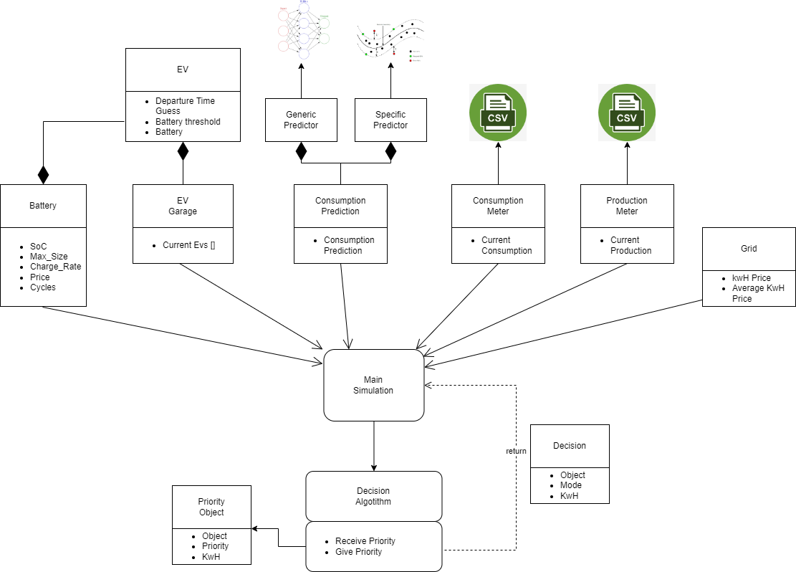
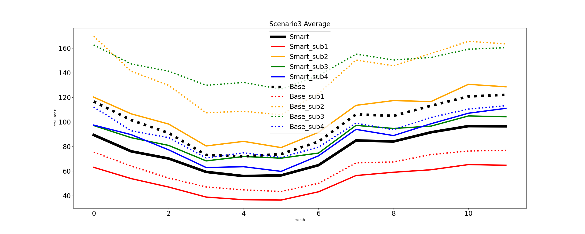

This work is part of my Master thesis in software engineering work: *MSc_Jo_o_Silva.pdf*    
The part related to the Household Energy Consumption Prediction can be found in: https://github.com/joaonpsilva/Tese_House_Energy_Prediciton 

# Energy Management Decision Algorithm

*IESES_Jo_oSilva__PAPER__Decision_Algorithm___Shared.pdf*  
Abstract—Electrical energy consumption is steadily growing
worldwide, while renewable energy sources are gaining market
share. In parallel, energy systems are undergoing a profound
transformation, moving from a top-down hierarchical structure
to a more decentralized model focused on the consumer, who
will also produce, store and sell their own energy. This paper
proposes a decision algorithm designed to help with the energy
management task, in the context of a grid-connected household,
with renewable energy production and electric vehicles (EVs).
The algorithm makes use of several inputs such as energy
consumption prediction, energy production output, EV battery
state, and grid energy price in order to perform the optimal
charge and discharge actions. The system’s objective is to
minimize the electrical bill of the household in several ways,
one of them, by utilizing EVs batteries for energy storage. The
proposed algorithm was validated in a simulated environment for
10 different households. In the several scenarios and test houses,
the proposed approach attained an average decrease of 18.9% in
the energy cost of the household.

Simulation Environment containing an Energy Management Decision Algorithm which objective is to optimize the energy usage of the household.

### Arch:  

### Results

## Run

Run main.py

Args:

- -ev, type=int, default = 2, help="number of Evs"
- -batt, type=int, default = 1, help="number of Stationary Batteries"
- -alg, type=str, default="smart", choices=["smart", "base"], help="Decision algorithm"
- -house, type=int, default = 0, help="Test File"
- -pA, type=int, default = 10, help="Panel Area"
- -pF, type=str, default="London", choices=["Portugal", "London"], help="Production file"
- -grid, type=str, default="dynamic", choices=["flat", "dynamic"], help="Grid Price"
- --cheat, help="Read consumption prediction in cheat file (faster)"

example: \
$ python3 main.py -ev 3 -house 1 --cheat